---
format:
  revealjs:
    theme: styles1.scss
    transition: fade
    slide-number: true
    wide: true
    chalkboard: true
    margin: 0.05
    footer: "Introduction to Health Economics | Fall 2026 | Session 5"
    controls: true
    center: true
---

::::{.layout="[90,10]"}
:::{first}

[Session 5]{.kicker}

<div class="rule"></div>

<p class="h1">Economic evaluation in Healthcare</p>

[Wu Zeng, MD, PHD, Georgetown University]{.label}
:::
:::{second}
<!-- nothing -->
:::
::::

---
```{r setup, include=FALSE}

knitr::opts_chunk$set(echo = FALSE, warning = FALSE, message = FALSE, 
  comment = NA, dpi = 300, fig.align = "center", out.width = "80%", cache = FALSE)
library(tidyverse)
library(readxl)
library(kableExtra)
library(DiagrammeR)
library(widgetframe)
```

::::{.slide-list}
:::{.list-header}

[Outline]{.kicker}

<div class="rule"></div>

<p class="h2">Outline of the session</p>

:::
:::{.list-body}
- What is economic evaluation?
- Why is it important in healthcare?
- Type of economics evaluation
  - cost-of-illness studies
  - cost-benefit analysis 
  - cost-effectiveness analysis
- Approaches to perform a cost-effectiveness analysis
  - Decision tree model
  - Markov model
:::
::::

---

## What is economic evaluation?

::::{.two-col-grid}
:::{.grid-item}

Economic evaluation is a [comparative]{.emcolor} analysis of [alternative courses]{.emcolor} of action in terms of both their [costs]{.emcolor} and [consequences]{.emcolor}.

- Definition: Drugs and other technologies are assessed for use and/or for a reimbursement price by looking at [incremental health-related effects]{.emcolor} and [costs]{.emcolor} relative to [existing treatments]{.emcolor}. 
:::
:::{.grid-item}

It is a tool to help decision-makers allocate scarce resources [efficiently]{.emcolor} to maximize [health benefits]{.emcolor} within the [budget]{.emcolor}.

- Budget constraints

- Optimize available of resources 

  - Key concept 1: Marginal benefit equals to marginal cost
  
  - Key concept 2: The resources used for an individual would results in that the resource could not be used for others
:::
::::

---

## Why is it important to measure the valuein healthcare?

<iframe width="800" height="400" src="https://www.youtube.com/embed/tPbMJe5xxgE" title="Keytruda, Immunotherapy Drug That Aided Jimmy Carter’s Cancer, ‘A Huge Deal’ | TODAY" frameborder="0" allow="accelerometer; autoplay; clipboard-write; encrypted-media; gyroscope; picture-in-picture; web-share" allowfullscreen></iframe>

Cancer immunotherapy drug Keytruda™ costs [\$150,000 per year]{.emcolor}

---

## Economic evaluation approaches

<image src="./pic/CEMethods.png" >

---

## Economic evaluation approaches continue...

<iframe width="800" height="400" src="https://www.youtube.com/embed/cUgkWYeRsJk" title="Health Economic Evaluation Basics - Putting a price tag on health -" frameborder="0" allow="accelerometer; autoplay; clipboard-write; encrypted-media; gyroscope; picture-in-picture; web-share" allowfullscreen></iframe>

---

## Type of economic evaluation

[Cost of illness studies]{.accent .lead}

::::{.two-col-grid}
:::{.grid-item}

Purpose: Estimate the economic burden of a diseases or health conditions, expressed disease burden in [monetary terms]{.emcolor} (what is the economic burden of diabetes in the US? What is the economic burden of Covid-19 in the US? etc.)

- $\text{Cost of illness}$ = Cost per episode * Number of episodes + cost per admission * number of admissions + loss of productivity per death * deaths
:::
:::{.grid-item}

Approaches: Convert morbidity and mortality into monetary terms, including

- [direct costs]{.emcolor} (medical costs or non-medical costs)
- [indirect costs]{.emcolor} (productivity loss)
- [intangible costs]{.emcolor} (pain and suffering)
:::
::::

---

## Cost-of-illness of dengue in Puerto Rico [^1]

::::{.two-col-grid}
:::{.grid-item}

<center>

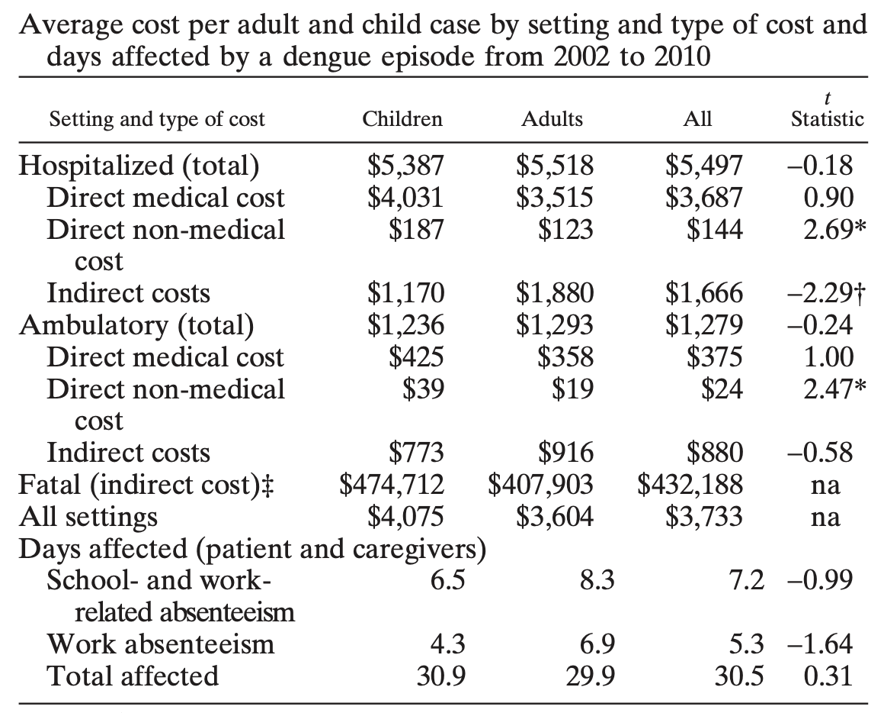

</center>
:::

:::{.grid-item}

<center>

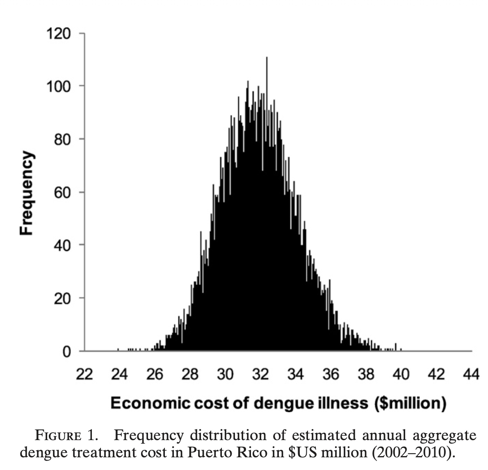

</center>

:::
::::

[^1]: Halasa YA, Shepard DS, **Zeng W**. Economic cost of dengue in Puerto Rico. Am J Trop Med Hyg. 2012 May;86(5):745-752.

---

## Cost-benefit analysis (CBA)

::::{.two-col-grid}
:::{.grid-item}

Purpose: 

- Compare the costs and [benefits]{.emcolor} of an intervention in [monetary]{.emcolor} terms (e.g., what is the benefit of a new drug in monetary terms? What is the cost of a new drug in monetary terms? etc.)

:::
:::{.grid-item}

Requirement: 

- Identify the costs and benefits of the intervention in [monetary terms]{.emcolor}
- Calculate the net [benefit]{.emcolor} (benefit minus cost) or [benefit-cost ratio]{.emcolor} (benefit divided by cost)
- Compare the net benefit or benefit-cost ratio of the intervention with that of alternative interventions
:::
::::

---

::::{.slide-list}
:::{.list-header}
[Cost-benefit analysis]{.kicker}

<div class="rule"></div>

<p class="h2">Cost-benefit analysis (CBA) continue...</p>

Converting future value to present value using a discount rate

:::

:::{.list-body}
- Benefit and the cost can be in the future, and we need to discount the future benefit and cost to present value using a [discount rate]{.emcolor} (e.g., 3% per year)
- Present value (PV) of future benefit or cost can be calculated using the following formula:
- $PV = \frac{FV}{(1+r)^t}$, where FV is future value, r is discount rate, and t is time in years
- Selection of [discount rate]{.emcolor}
  - US often uses [3% per year]{.emcolor} for both costs and benefits
  - UK often uses [3.5% per year]{.emcolor} for both costs and benefits
:::
::::
---

::::{.slide-list}

:::{.list-header}
[Example: CBA]{.kicker}

<div class="rule"></div>

<p class="h2">Example of cost-benefit analysis (CBA)</p>

Estimation of the cost benefit of coming to Georgetown University to pursue a bachelor degree vs. working in the US for 4 years after high school graduation.

:::

:::{list-body}
Assumptions

:::{.bullet-list}
- Tuition and fees: $50,000 per year
- Living expenses: $20,000 per year
- Opportunity cost of not working: $30,000 per year
- Total cost of attending Georgetown University for 4 years: $400,000
- Expected salary after graduation: $80,000 per year
- Expected salary without a degree: $50,000 per year
- Expected salary increase due to degree: 3.5% per year
- Time horizon: 40 years (from age 22 to age 62)
- Discount rate: 3% per year
:::
:::
::::

---

## Estimation 

```{r echo= F}

read_excel("S5-CBA.xlsx", sheet = "Sheet2", range = "A1:I11") |>
  kable(Booktabs = T) |>
  kable_styling(latex_options = c("striped", "hold_position"), full_width = F, position = "center")
```

Cost-benefit ratio = $268,003/1,058,746 = 1/3.95 $

---

## Cost-effectiveness analysis (CEA) 

Incremental cost-effectiveness ratio (ICER)

::::{.two-col-grid}
:::{.grid-item}

- Numerator: Difference between cost of new drugs and that of alternative under study

- Denominator: Difference of health outcomes (Effectiveness) of new drugs and alternative

$ICER = \frac{{Cost_{New Drug}}-Cost_{Status Quo}}{Effectiveness_{New Drug}-Effectiveness_{Status Quo}} = \frac{\Delta Cost}{\Delta Effectiveness}$

:::
:::{.grid-item}
What is the meaning of ICER? 

<center>

> [Price]{.emcolor} to pay in order to gain 1 unit increase in the health benefit

</center>
:::
::::

---

## Steps to perform a cost-effectiveness analysis (CEA)

::::{.two-col-grid}
:::{.grid-item}

- Define the [perspective]{.emcolor} of the analysis (e.g., societal, healthcare system, payer, patient)
- Define the [time horizon]{.emcolor} of the analysis (e.g., short-term, long-term)
- Define the [alternative interventions]{.emcolor} to be compared (e.g., new drug vs. standard treatment)
- Identify the [costs]{.emcolor} and [effectiveness]{.emcolor} of each alternative intervention
:::
:::{.grid-item}
- Calculate the [incremental cost]{.emcolor} and [incremental effectiveness]{.emcolor} of the new drug compared to the standard treatment
- Compare the ICER against the [threshold value]{.emcolor} 
- Perform [sensitivity analysis]{.emcolor} to assess the robustness of the results
:::
::::

---

## Define perspectives of study

::::{.three-col-grid}
:::{.grid-item}

[Societal perspective]{.emcolor}

Include all costs and benefits, regardless of who incurs the costs or receives the benefits

:::
:::{.grid-item}

[Healthcare system perspective]{.emcolor}

Include only costs and benefits that are relevant to the healthcare system (e.g., costs of drugs, hospitalizations, and medical procedures)
:::
:::{.grid-item}

[Payer perspective]{.emcolor}

Include only costs and benefits that are relevant to the payer (e.g., insurance company, government)
:::
::::

---

## Examine the costs

::::{.two-col-grid}
:::{.grid-item}

Components of costs

- Cost of intervention 

- Savings from the interventions 

- cost of side effects

:::
:::{.grid-item}

Type of costs 

- Direct costs: medical costs (e.g., drugs, hospitalizations, medical procedures) and non-medical costs (e.g., transportation, caregiver time)
- Indirect costs: productivity loss (e.g., lost wages, lost productivity due to illness or death)
:::
::::

***Discount future costs***

---

## Effectiveness measures 

::::{.two-col-grid}
:::{.grid-item}

- Common measures of health consequences
   - [Health outcomes]{.emcolor}
        - Mortality (death rate) or morbidity (e.g. incidence, prevalence) or disability (Quality of life)
  - [Intermediate health outcomes]{.emcolor}
      - Changes in the risk of ill-health (e.g. smoking, drinking, blood pressure reduction)   
  - [Process measure]{.emcolor} (e.g. hospital stay) 
  - [Composite measures]{.emcolor}
      - Quality adjusted life years (QALYs)
      - Disability adjusted life years (DALYs)
:::
:::{.grid-item}
- Fatal cases 
  - Life years saved (LYs)
- Non-fatal cases
  - Quality-adjusted life years (QALYs)
    - Utility
    - Duration of illness
:::
::::

---

## Survival measures 

::::{.two-col-grid}
:::{.grid-item}

- Life years saved (LYs)
- Survival rate

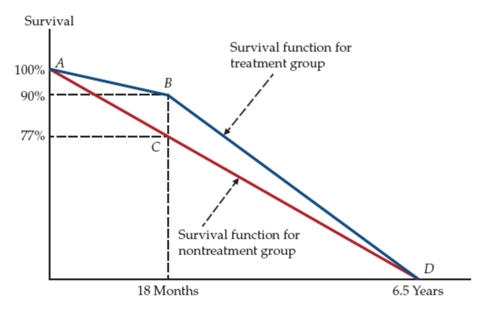

:::
:::{.grid-item}

- LYs gains
  - (ABC) = 1/2(0.90 − 0.77) × 1.5 = 0.0975 years
  - (BCD) = 1/2(0.90 − 0.77) × 5 = 0.325 years
  - Total = 0.0975 + 0.325 = 0.4225 years

:::
::::

---

## Quality-adjusted life years (QALYs)

::::{.two-col-grid}
:::{.grid-item}

Some interventions may have a combination of multiple impact 

1. Improve the [duration]{.emcolor} of survival (mortality)

2. Reduce the [risk of diseases]{.emcolor} (morbidity)

3. Improve the [quality of life]{.emcolor} during the illness (quality of life) 

:::
:::{.grid-item}

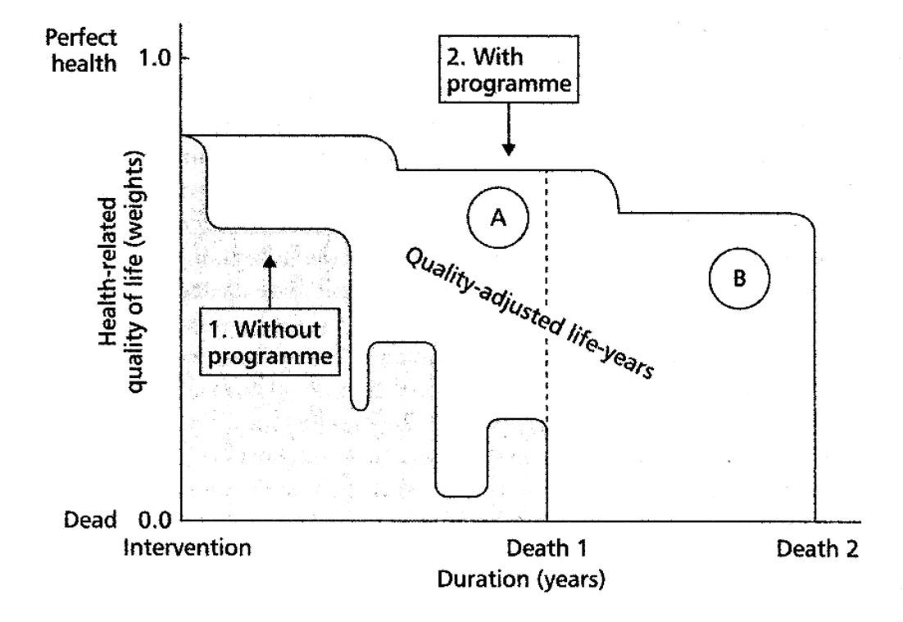

:::
::::

---

## QALYs continue... 

<iframe width="1200" height="500" src="https://www.youtube.com/embed/l69St-vJnM8" title="QALY in Health Economic Evaluations" frameborder="0" allow="accelerometer; autoplay; clipboard-write; encrypted-media; gyroscope; picture-in-picture; web-share" referrerpolicy="strict-origin-when-cross-origin" allowfullscreen></iframe>

---

## Quality-adjusted life years (QALYs)

::::{.two-col-grid}
:::{.grid-item}

$QALY = Q*LYs$, where Q is [Quality of Life]{.emcolor} and LY is [Life **Years**]{.emcolor}

$\Delta QALYs = Q_{n}*LYs_{n} - Q_{s}*LYs_{s}$

where `n` means new drugs and `s` standard treatment

:::
:::{.grid-item}

> A typical TB patient with has an average quality of life of [0.8]{.emcolor} during the illness, and the TB symptoms last [6 months]{.emcolor} until the patient is fully recovered.

- How many QALYs does the patient live during the illness?

- How many QALYs saved per case if TB vaccine could avert the TB?
:::
::::

---

::::{.slide-list}
:::{.list-header}
[Calculation]{.kicker}

<div class="rule"></div>

<p class="h2">Calculation of QALYs</p>

:::
:::{second-column}

$QALY_s = Q_s*LYs_s = 0.8*\frac{6}{12} = 0.8*0.5= 0.4$

$\Delta QALYs = Q_{n}*LYs_{n} - Q_{s}*LYs_{s}$

$Q_{n}*LYs_{n} = 1*\frac{6}{12}=1*0.5=0.5$

$\Delta QALYs = 0.5-0.4=0.1$
:::
::::

---

## Quality of life measures 

::::{.two-col-grid}
:::{.grid-item}
- Quality-adjusted life years (QALYs)
- 0 = death, 1 = perfect health
- Utility score can be measured using different methods, including
  - Visual analog scale (VAS)
  - Scale measures (EuroQol, SF-6D, HUI, etc.)
  - Time trade-off (TTO)
  - Standard gamble (SG)
:::

:::{.grid-item} 

:::{.panel-tabset}

### EQ-5D

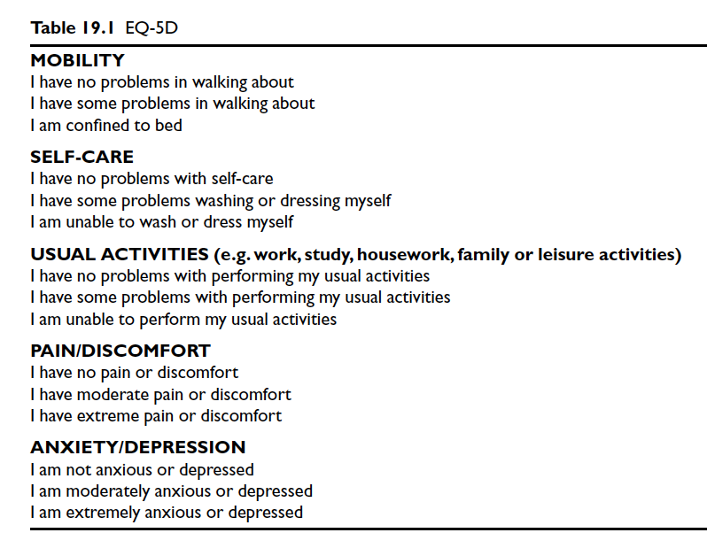

### Visual analog

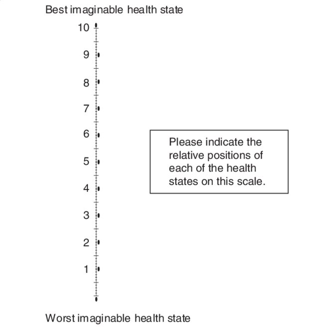

### Time trade-off

Standard time trade-off offering 2 options:

- Chronic health state for t years

- Normal(Perfect) health for x years (where x is less than t),

Vary length of x until individual is indifferent between two options

Utility value of one year in chronic health state is x/t

:::
:::
::::

---

## Time trade-off example 

> A person with chronic pain would live for another 10 years. He/she will be indifferent between living for 10 years with chronic pain and living for 6 years with perfect health. What is his/her quality of life? 

$$6/10 = 0.6$$

--- 

## Standard gambling approach 

::::{.two-col-grid}
:::{.grid-item}

You're presented with two options:

- Option A (Certainty): Live with a specific health problem (e.g., severe pain) for the rest of your life.

- Option B (The Gamble): A chance (probability p) of achieving perfect health and a chance (1-p) of immediate death.

Finding Indifference: The probability p is adjusted until you're equally happy with Option A as with Option B (you're indifferent).

Calculating Utility: This indifference point helps calculate a utility score (U) for that health state, often using the formula: $U = p \times 1 + (1-p) \times 0$, where 1 is perfect health and 0 is death.

:::
:::{.grid-item}


```{r include=TRUE, echo=FALSE}
m <-grViz("
digraph{
graph [rankdir = LR]
node [shape = circle, style = filled, fillcolor = Beige] 

a [label = '']
b [label = '']
c [label = '']
d [label = 'Healthy']
e [label = 'Dead']
f [label ='State i']

a -> b [label = 'Alternative 1']
b -> d [label = 'probablity p']
b -> e [label = 'Probability 1-p']
a -> c [label = 'Alternative 2']
c -> f [label = '']
}
      ")

frameWidget(m)

```
:::
::::

---

## Estimation Incremental Cost-effectiveness Ratio (ICER)

::::{.two-col-grid}
:::{.grid-item}

$$ICER = \frac{\Delta Cost}{\Delta QALYs}$$

Interpretation: The ICER is the [price]{.emcolor} to pay in order to gain 1 unit increase in the health benefit (e.g., 1 QALY).

if ICER is $800 per QALY, is it cost effective in US?

What about in Afghanistan? 
:::
:::{.grid-item}

<center> 

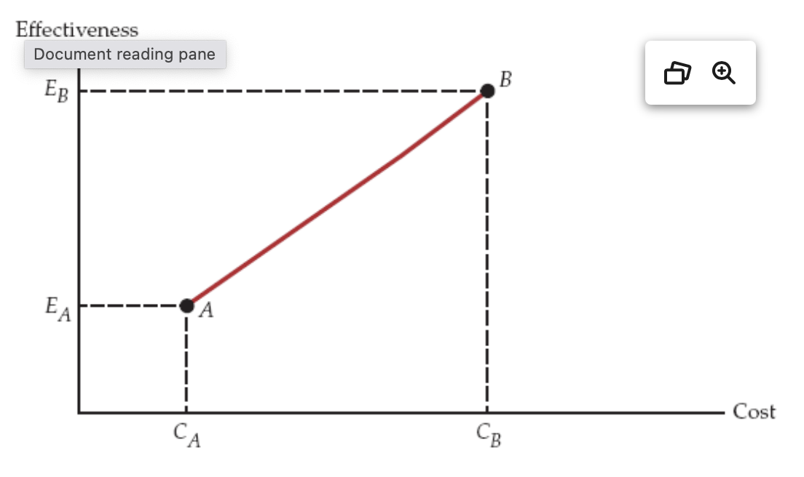

</center>

:::
::::

---

## ICER for multiple interventions

<center> 

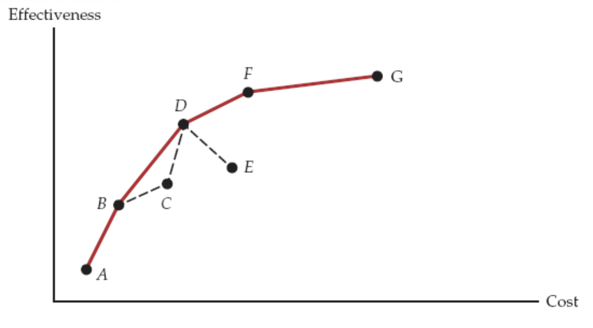

</center>

---

## An hypothetical example 

> A dengue vaccine cost [\$20]{.emcolor} per dose. Full vaccination a child under 9 years old requires 3 doses. The efficiency of the dengue vaccine was estimated to be [60%]{.emcolor}. The [QALYs loss]{.emcolor} per dengue infection, on average was estimated to be [0.035]{.emcolor}. 

> The [incidence]{.emcolor} of dengue in the country was estimated to be [2%]{.emcolor} among children under 9. Assuming that the treatment cost per dengue case is, on average, [\$200 per infection]{.emcolor}. What is the incremental cost-effectiveness ratio (ICER) of the dengue vaccine. 

---

## Calculation

$\Delta Cost \text{ per person} = (20*3 + 100*0.02*0.4) - (0 + 100*0.02) = 58.8$

$\Delta QALY \text{ per person} = 2\%*0.035*0.6 = 0.00042$

$ICER = \frac{58.8}{0.00042} = 140,000$

What does this number tell us? Is it worthwhile to deploy the vaccine to control dengue?

---

## Compare ICER with threshold value

::::{.two-col-grid}
:::{.grid-item}

<center>


</center>
:::
:::{.grid-item}

- Threshold value: The maximum amount of money that a society is willing to pay for a unit of health benefit (e.g., 1 QALY)
  - Willness to pay (WTP) threshold value is often used as a benchmark to determine whether an intervention is cost-effective or not.
  - GDP per capita is often used as a proxy for WTP threshold value.
  - WHO Suggests 
    - < 1x GDP per capita: Highly cost-effective
    - 1-3x GDP per capita: Cost-effective
  - I use 1.5 x GDP per capita as the threshold value for my studies
:::
::::


---

## Sensitivity analysis

::::{.two-col-grid}
:::{.grid-item}
- Sensitivity analysis is a method to assess the robustness of the results of a cost-effectiveness analysis (CEA) by varying the key parameters of the model (e.g., costs, effectiveness, discount rate, etc.) and examining how the results change.
:::
:::{.grid-item}
- Types of sensitivity analysis
  - One-way sensitivity analysis: Vary one parameter at a time and examine the impact on the results.
  - Multi-way sensitivity analysis: Vary multiple parameters at the same time and examine the impact on the results.
  - Probabilistic sensitivity analysis: Use probability distributions to model the uncertainty of the parameters and examine the impact on the results.
:::
::::

---

## Decision tree model

::::{.two-col-grid}
:::{.grid-item}

- Suitable for short-term and non-repeated health outcomes
- Requirement 
  - Construct a decision tree model to represent the health outcomes and pathway of the alternative interventions
  - Identify the probabilities of each health outcome and the cost and effectiveness associated with each outcome
- Calculate the expected cost and effectiveness of each alternative intervention
:::
:::{.grid-item}

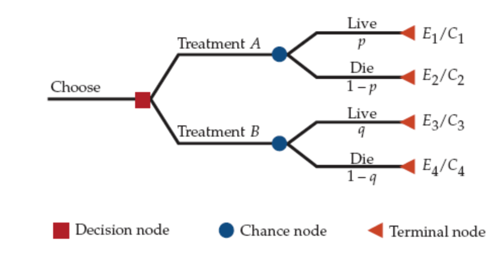

:::
::::

---

## Example of decision tree model 

Decision tree for CHW program (Effectiveness)

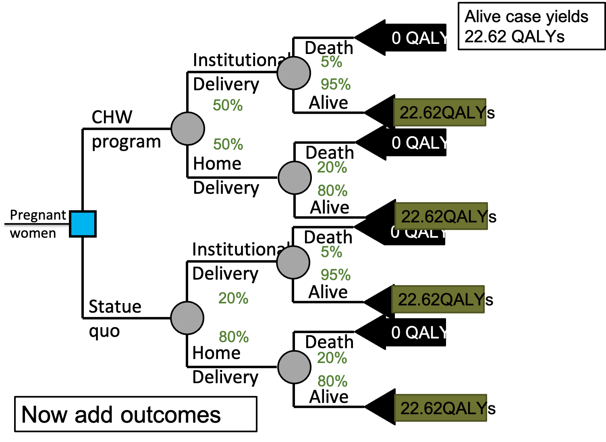

---

## Decision tree for CHW program (Cost)

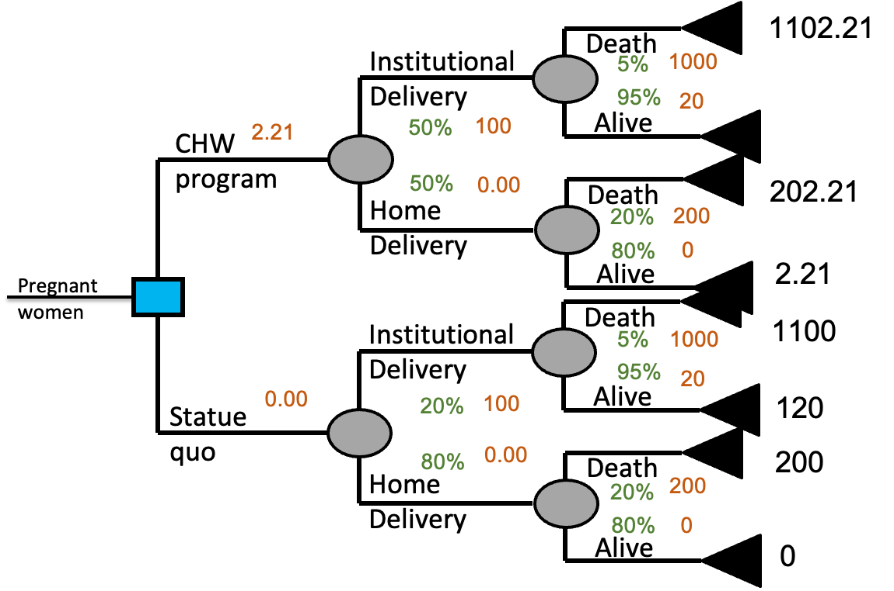

---

## Average out & fold back

::::{.two-col-grid}
:::{.grid-item}

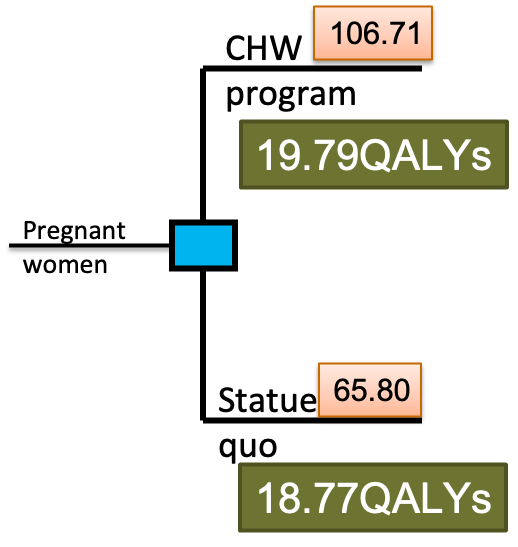

:::
:::{.grid-item}

- The net cost per pregnant woman is
  - $106.71 − $65.80 = $40.91
- Gained DALYs are 
  - 19.79 − 18.77 = 1.02
- ICER = $40.91 / 1.02 = $40.11/QALY

:::
::::

---

## Markov model 

::::{.two-col-grid}
:::{.grid-item}

- Suitable for long-term (chronic diseases) and repeated health outcomes (infectious diseases)
- Requirement 
  - Define the cycle length and time horizon for the model
  - Construct a Markov model to represent the health states and pathway of transition among states 
  - Identify the transition probabilities of each health state
  - Attach the cost and effectiveness (utility) associated with each state

:::
:::{.grid-item}

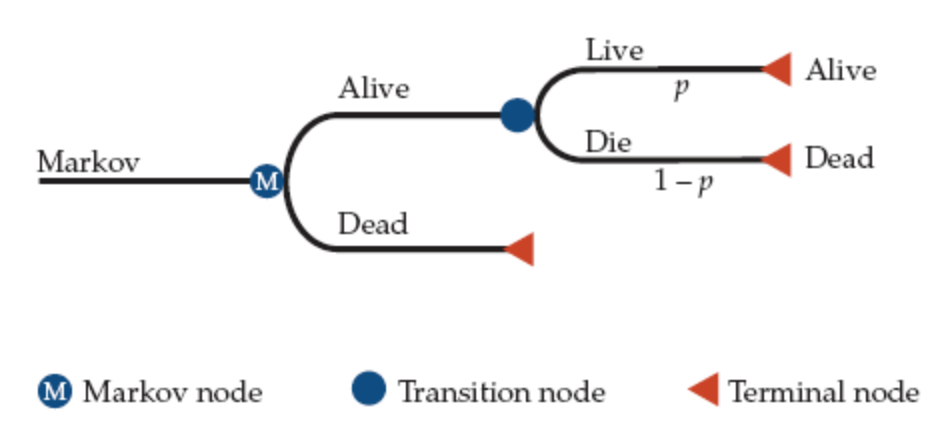

:::
::::

---

## Issues of using CEA 

::::{.two-col-grid}
:::{.grid-item}

Major issues in using CEA to value phmarceutical innovations

- Ethical issue

- Equity issue

- Technical issues 

  - No consensus on dimensions of effectiveness to be measured 

  - The heterogeneity of willingness to pay

  - How to compare cost and effectiveness 

:::
:::{.grid-item}
<center>

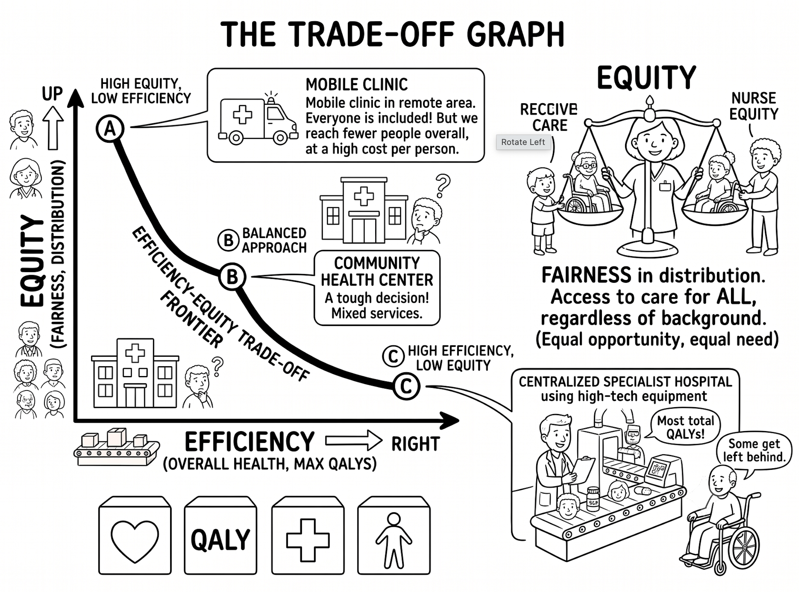

</center>
:::
::::

---

## Summary

::::{.two-col-grid}
:::{.grid-item}

:::{.bullet-list}

- CEA has been widely used for valuing pharmaceutical innovation 

- CEA is also important instrument for valuing health services

- There are many new developments in addressing the technical issues of CEA

- CEA is [NOT]{.emcolor} the only criterion for valuing pharmaceutical innovation
:::
:::
:::{.grid-item}

<center>

> "CEA is not the only and ultimate evaluation tool!"

</center>


:::
::::

---

## Questions and comments {.center}